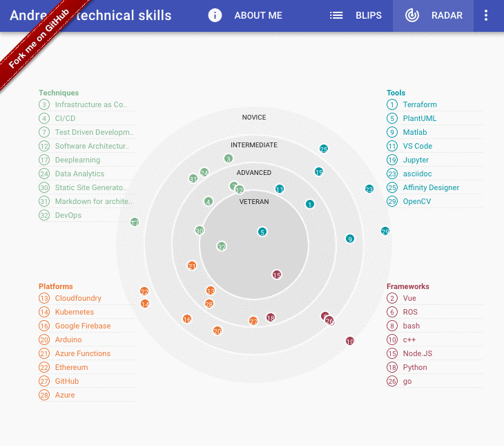
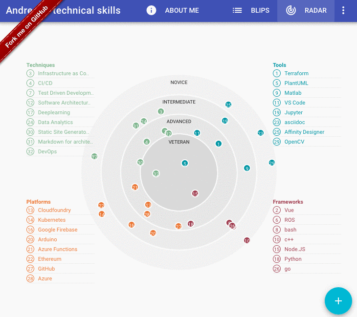
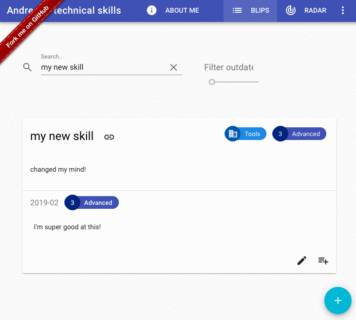

# Techradar 📡

[](https://greenkeeper.io/)

> single page web app to manage your own techradar

<!-- TOC depthFrom:2 -->

- [Features](#features)
  - [Demo](#demo)
- [Design](#design)
  - [Role based access](#role-based-access)
- [Setup](#setup)
  - [Customize](#customize)
  - [Deployment](#deployment)
- [Attributions](#attributions)

<!-- /TOC -->

A full open source solution to build a custom technology radar as pioneered by [Thoughtworks](https://www.thoughtworks.com/radar). See [radar-demo.anoff.io](https://radar-demo.anoff.io) for an authentication free test environment.

The master branch of this repository holds a techradar version customized towards showing my [personal technology](https://radar.anoff.io) set. For building a teams or organizations techradar it might be better to stick with the original _Hold_, _Assess_, _Trial_, _Adopt_ style.

## Features

- [x] add new blips
- [x] modify blips
- [x] render tech blips on radar
- [x] show blip history
- [x] make radar categories customizable
- [x] oauth (github, twitter)
- [ ] user name management

### Demo

Here are a few short demos of how the app can be used

*Browse the radar/list view*



*Create a new entry*



*Update or delete an entry*



## Design

The main part is a static Vue.js application using Firebase as backend and authentication provider.


Database schema


### Role based access

Using OAuth users can signup to the service with a valid Twitter or GitHub account. By default users have no roles assigned. There are three roles that can be assigned to users in the `/users` section: **admin**, **editor**, **viewer**.

These roles can be used to prevent access to sections by setting the [config](#customize). Access to the data itself is controlled by [Firestore security rules](firestore.rules) that make use of the same three roles. Opening/Restricting access to data requires a change in the firestore rules as well.

## Setup

You should be able to get your own version up and running within **15 minutes** and no incurring infrastructure costs.
The easiest way to set up your own radar is to

1. [fork](https://help.github.com/articles/fork-a-repo/) this repository
1. create a [firebase project](https://firebase.google.com/)
1. create [Twitter app](https://apps.twitter.com/) and configure [firebase sign in method](https://firebase.google.com/docs/auth/web/twitter-login)
1. create [GitHub app]() and configure [firebase sign in method](https://firebase.google.com/docs/auth/web/github-auth)
1. [customize](#customize
) the techradar to your needs
1. [deploy](#deployment) it using [Travis CI](https://travis-ci.com).
1. log in using the Twitter or GitHub OAuth provider
1. access the firebase database and within the `/roles` collection set `admin: true` for your account

### Customize

The main files to customize are [the config](src/config.js), [the stylesheet](src/assets/radar.scss) and [database security rules](firestore.rules). The **theme colors** together with the labels for **categories** and required **permissions** to access specific resources can be found in the config.

The stylesheet can be modified to change the **radar colors** or the size/responsiveness.

The `editPermissions` function in the config specifies which roles are required for a user to add/edit/delete blips.

```javascript
editPermissions: user => user.roles.admin || user.roles.editor
```

For each `route` defined in the config a similar function is defined in the `validator` property that needs to return true for the currently logged in user to be able to see a specific section.

```javascript
{ view: 'List', icon: 'list', title: 'Blips', path: '/list/:search?', validator: user => user.uid, location: ['toolbar'] }
```

- `user => true` shows the site to everyone
- `user => user.uid` requires a logged in user (users can sign up via OAuth)
- `user => user.roles.admin` requires users to have an admin role

> Settings should be consistent between the [config](src/config.js) and [firestore security rules](firestore.rules)

### Deployment

After creating a project, create a CI token and encode it for Travis CI use

```sh
# create a firebase CI token
firebase login:ci

# encrypt the token to your project
docker run --rm caktux/travis-cli encrypt "<token from firebase login:ci>" -r <github repo>
```

Log into firebase and initialize an empty **Firestore** database in locked mode.

Copy the resulting token to [the Travis CI config](.travis.yml) under `deploy / token /secure`. Modify `deploy / project` to equal your firebase **Project ID**.
One mandatory customization to the [config](src/config.js) is to set `firebase.key` and `firebase.project` to your **Web API Key** and **Project ID** respectively.

## Attributions

- [Urban Sanden](https://github.com/urre/radar/) @ [MIT](https://github.com/urre/radar/blob/502b57332467e68819ce69eeb65f8432129d69b9/LICENSE)
  - Inspiration for placing the blips
  - parts of his SCSS styles
